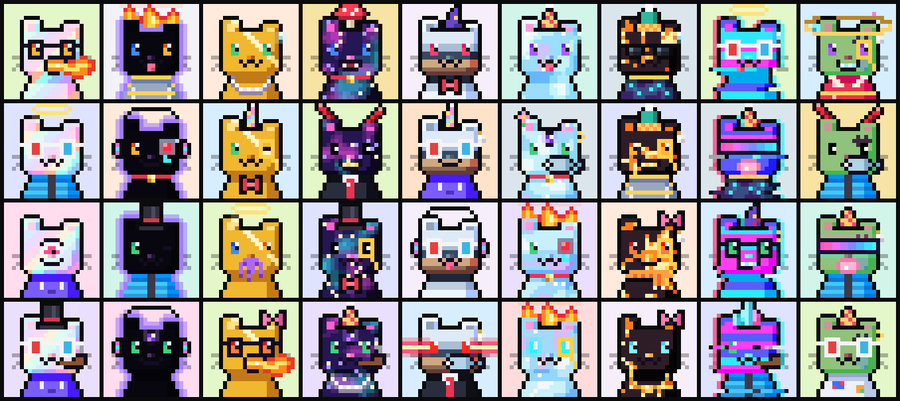

# CryptoPurrls

**10.000 con mèo pixel 24×24 mọc ra từ một logo.**


Logo Purrl là một hình khối 14×14: đầu vuông, tai trái cao 3 ô, tai phải thấp 2 ô, cằm vát hai góc. Mọi CryptoPurrl giữ nguyên silhouette đó, đặt 1:1 lên khung 24×24. Toàn bộ bộ sưu tập là hàm thuần của một seed, nên ai cũng dựng lại được đúng 10.000 con và kiểm tra với provenance hash bên dưới.

```
####..........      ← tai trái cao
####......####      ← tai phải thấp; khoảng trống ở giữa là chỗ đội mũ
####......####
##############
      ×10
.############.      ← cằm vát
```

## Phong cách

Gọn như một con tem: **nền một màu phẳng sáng nhạt, viền mực sắc, con mèo rực màu.** Mỗi chất liệu (lông, vằn, vải…) chỉ có hai tông là màu gốc và một tông bóng ở mép phải, dưới cằm và cổ. Mỗi Purrl được dựng qua năm lớp: **Logo → Silhouette → Light → Face → Traits**. Một bộ lông sẽ không bao giờ đi cùng nền trùng màu với nó.

## Huyền thoại

Mười bộ lông có số lượng cố định. Những bộ lông còn lại được quay ngẫu nhiên theo trọng số. Cosmic, Lava, Crystal, Leopard và Moo vẽ hoa văn theo số hiệu của từng con, nên không con nào giống con nào.

| Bộ lông | Số lượng | Đặc điểm |
|---|---:|---|
| **Genesis** | 1 | Purrl #0 chính là logo, được đùn sâu ba pixel xuyên qua một lăng kính, trên nền mực phẳng. |
| **Pearl** | 9 | Lông xà cừ với những dải hồng, kem, bạc hà chạy chéo. Đây là nguồn gốc của cái tên *Purrl*. |
| **Void** | 13 | Một hố đen hình con mèo: chỉ còn đôi mắt, viền neon tím và quầng sáng hắt ra nền. |
| **Gold** | 24 | Vàng đánh bóng, có vệt loé chéo. Không bao giờ đi cùng phụ kiện vàng. |
| **Cosmic** | 42 | Bên trong bộ lông là một dải thiên hà, mỗi con có một bầu trời sao riêng. |
| **Chrome** | 55 | Kim loại lỏng phản chiếu đường chân trời. |
| **Crystal** | 66 | Pha lê trong suốt, nhìn xuyên qua thấy nền phía sau. |
| **Lava** | 77 | Đá bazan nứt với dung nham sáng trong các khe. |
| **Glitch** | 88 | Tín hiệu hỏng: viền tách màu RGB và vài dòng quét bị xé lệch. |
| **Zombie** | 111 | Lông xanh rêu, có vết khâu và một miếng da vá. |




## Trait

Số con mang từng trait trong 10.000 Purrl:

- **Fur**: Cream 1.266 · Ginger 1.231 · Smoke 988 · Midnight 887 · Tuxedo 818 · Calico 685 · Siamese 595 · Bubblegum 581 · Lilac 534 · Mint 491 · Tiger 373 · Moo 309 · Leopard 291 · Neon 290 · Rainbow 175 · Zombie 111 · Glitch 88 · Lava 77 · Crystal 66 · Chrome 55 · Cosmic 42 · Gold 24 · Void 13 · Pearl 9 · Genesis 1
- **Background**: Lemon 992 · Sky 984 · Bubblegum 950 · Lime 896 · Periwinkle 879 · Mint 865 · Coral 841 · Tangerine 808 · Peach 792 · Lavender 791 · Purrl Blue 547 · Cloud 474 · Gold 107 · Pearl 73 · Ink 1
- **Eyes**: Emerald 1.357 · Amber 1.158 · Sapphire 982 · Copper 733 · Amethyst 522 · Sleepy 503 · Ruby 431 · Ice 381 · Stars 289 · Odd Eyes 286 · Hearts 282 · KO 216 · Wink 207 · Neon Glow 153 · Cyclops 151 · Third Eye 145 · Void 138 · Laser 97
- **Mouth**: Purr 2.771 · Smile 1.803 · Blep 1.565 · Hiss 776 · Bubblegum 705 · Pipe 594 · Gold Grill 443 · Fish 397 · Rainbow Tongue 327 · Diamond Grill 241 · Tentacles 204 · Fire Breath 173
- **Eyewear**: Shades 811 · Specs 569 · 3D Glasses 471 · Holo Shades 346 · Eye Patch 341 · Neon Visor 340 · Monocle 336 · Cyber Eye 191
- **Headwear**: Headphones 582 · Top Hat 576 · Beanie 551 · Party Hat 494 · Bow 484 · Flower 448 · Antenna 379 · Devil Horns 358 · Wizard Hat 349 · Mushroom 329 · Halo 320 · Flame 238 · Orbit 231 · Unicorn Horn 225 · Crystal Shards 220 · Crown 114 · Brain Jar 101
- **Outfit**: Collar & Bell 1.560 · Gold Chain 870 · Hoodie 848 · Bow Tie 801 · Suit 641 · Scarf 618 · Puffer 452 · Astronaut 342 · Pearl Necklace 324 · Armor 308 · Kimono 295 · Rune Robe 197
- **Earring**: Pearl Earring 451 · Gold Hoop 367 · Diamond Stud 98

Một số luật ghép trait:

- Con nào đeo kính che mắt (Shades, Holo Shades, 3D Glasses, Neon Visor) thì không có trait Eyes.
- Bộ lông không bao giờ trùng màu với nền (ví dụ Mint không đứng trên nền Mint).
- Các kiểu mắt nổi bật (Laser, Cyclops, Third Eye, Hearts, Stars, KO) không bao giờ bị kính che.
- Mỗi bộ lông tránh những trait sẽ bị chìm vào nó, ví dụ Gold không đeo dây chuyền vàng và Void không đeo kính đen.
- Không có hai Purrl nào trùng toàn bộ trait.

Hạng độ hiếm được tính theo kiểu rarity.tools: điểm là tổng `10.000 / số con mang trait` của mọi loại trait (tính cả "None") cộng thêm số phụ kiện. Hạng 1 là con hiếm nhất (#0 Genesis).

## Provenance

| | |
|---|---|
| Seed | `0x50555252` ("PURR") |
| Provenance hash | `5dd6598ac889804f61088ae62bf6d1e9c61f404e31743526963c9ba25811e747` |
| SHA-256 của mosaic | `845d23af2cee15e597012cf3957cc189f731daa6617295245c5317f2cb24d88d` |

Provenance hash là `sha256` của chuỗi nối các `sha256` dạng hex của từng Purrl, theo thứ tự #0 → #9999. Mỗi `sha256` được tính trên 2.304 byte RGBA thô (24×24×4) của Purrl đó. Hash mosaic được tính trên pixel RGBA của `dist/purrls.png` (2400×2400, 100 con mỗi hàng). Vì băm trên pixel chứ không băm byte PNG, kết quả không phụ thuộc phiên bản zlib. Trang gallery có nút xác minh, bấm vào sẽ dựng lại cả 10.000 con ngay trong trình duyệt và so với hai hash này.

## Cách chạy

Chỉ cần Node 18 trở lên, không có dependency nào.

```bash
npm run build       # dist/: mosaic, purrls.json, rarity.json, provenance.json, ảnh preview
npm run build:all   # thêm dist/images/<id>.png (480×480) và dist/metadata/<id>.json (ERC-721)
npm run serve       # gallery tại http://localhost:4173
```

Metadata ERC-721 để sẵn `ipfs://<IMAGES_CID>/<id>.png`. Sau khi upload thư mục `dist/images` lên IPFS, thay `<IMAGES_CID>` bằng CID thật.

## Cấu trúc

| File | Nội dung |
|---|---|
| `src/purrl.js` | Toàn bộ generator: silhouette, bản đồ ánh sáng, ramp màu, nền, sprite của từng trait, trọng số, PRNG (mulberry32), render và tính độ hiếm. Là ES module thuần, chạy được cả trong Node lẫn trình duyệt. |
| `scripts/build.mjs` | Dựng collection rồi ghi mọi thứ vào `dist/`. |
| `scripts/png.mjs` | Bộ mã hoá PNG tối giản dựa trên `node:zlib`. |
| `scripts/serve.mjs` | Server xem thử gallery ở máy. |
| `site/index.html` | Trang gallery: trưng bày từng lớp dựng hình, các tier huyền thoại, bộ lọc trait, mosaic và nút xác minh provenance. |
| `dist/purrls.png` | Mosaic 2400×2400 chứa đủ 10.000 Purrl ở tỉ lệ 1×. |
| `dist/purrls.json` | Trait và hạng độ hiếm của từng Purrl. |

Sửa sprite, màu hay trọng số trong `src/purrl.js` sẽ làm thay đổi bộ sưu tập và provenance hash. Hãy chạy lại `npm run build` rồi commit cả `dist/`.
