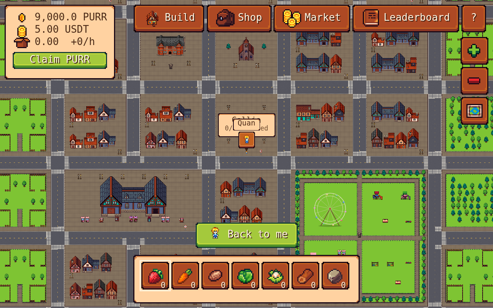
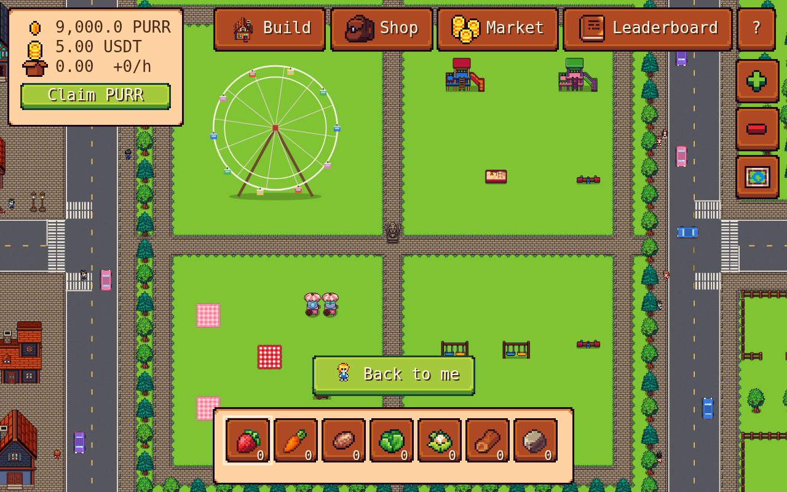
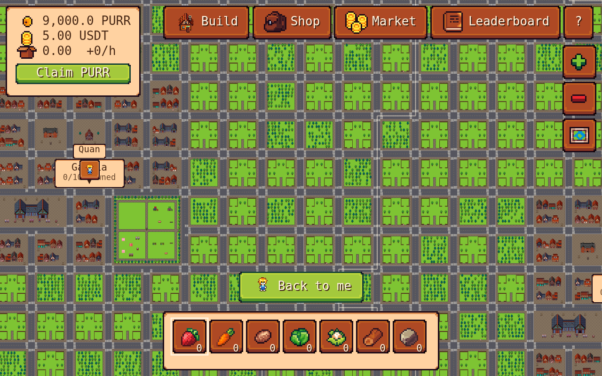

# Purrl Valley

A pixel farming web game on a continent shaped like Europe, played with play money (PURR / USDT).

- 4,444 farms in 37 districts. Each farm has a house in the middle, a path to the door and four fields for crops or animals.
- Buy single plots or a whole district, build and upgrade houses that mine PURR, plant crops, raise chickens, sheep, pigs and cows.
- Two-way roads with zebra crossings, stop signs and traffic lights; townsfolk walk (some with dogs), cars stop at red lights.
- Every district has a city: old-town blocks, a fun park with a Ferris wheel, a grand mall, and in big districts a cathedral and a school.
- Zoom from a single field out to the whole continent; "Back to me" finds your character again.

The whole game is one file: [`game/purrl-valley.html`](game/purrl-valley.html).

Art: Farm RPG Tiny Asset Pack by EmanuelleDev. Roads, cars, signs and traffic lights are drawn in matching pixel art.
