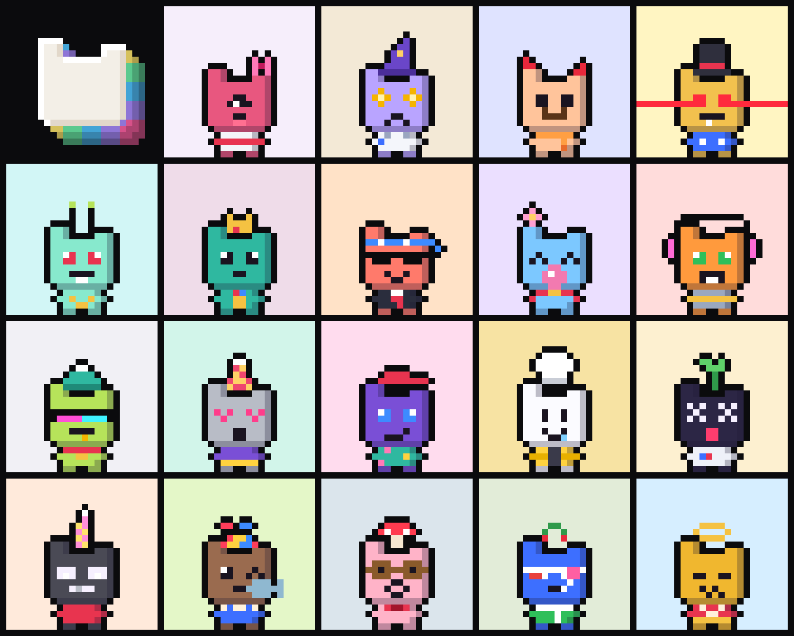

# CryptoPurrls

**20 sinh vật pixel 24×24 mọc ra từ một logo. Không có trait nào xuất hiện hai lần.**



Logo Purrl là một khối 14×14: đầu vuông, chỏm trái cao 3 ô, chỏm phải thấp 2 ô, cằm vát hai góc. Mỗi Purrl là một sinh vật nhỏ trên khung 24×24: đầu là logo thu về 10×10 (vẫn đủ chỏm cao, chỏm thấp, khoảng trống giữa và cằm vát), thân bé xíu và hai chân chạm sát mép dưới ảnh.

```
###.......      ← chỏm trái cao
###....###      ← chỏm phải thấp; khoảng trống ở giữa là chỗ đội mũ
##########
    ×7
.########.      ← cằm vát
```

## Phong cách

Tối giản để dễ nhìn ở cỡ ảnh đại diện:
- Thân một màu đơn sắc, chỉ có một tông bóng ở mép phải, dưới đầu và ở chân.
- Viền đen rõ nét.
- Mặt nhỏ gọn.
- Nền một màu nhạt.

Trên các thân màu tối, nét mặt được vẽ bằng màu sáng.

## Mọi trait đều 1/1

Có 6 loại trait: Body, Background, Eyes, Mouth, Headwear, Outfit. Mỗi loại có một danh sách giá trị được xáo trộn theo seed rồi chia lần lượt cho từng con, nên **mỗi giá trị chỉ có đúng một con mang**. Kính được gộp vào trait Eyes. Nếu màu thân quá gần màu nền hoặc màu áo, lần chia đó bị huỷ và chia lại.

Purrl #0 **Genesis** chính là logo, được đùn sâu ba pixel xuyên qua một lăng kính, trên nền mực.

| # | Body | Background | Eyes | Mouth | Headwear | Outfit |
|---|---|---|---|---|---|---|
| #0 | Genesis | Ink | — | — | — | — |
| #1 | Rose | Pearl | Cyclops | Tongue | Bow | Striped Shirt |
| #2 | Lilac | Sand | Stars | Frown | Wizard Hat | Lab Coat |
| #3 | Peach | Periwinkle | Round | Mustache | Devil Horns | Scarf |
| #4 | Mustard | Lemon | Laser | Fang | Top Hat | Hoodie |
| #5 | Mint | Aqua | Red | Grin | Antenna | Gold Chain |
| #6 | Teal | Mauve | Shiny | Line | Crown | Medal |
| #7 | Coral | Tangerine | Shades | Smile | Bandana | Suit |
| #8 | Sky | Lavender | Happy | Bubblegum | Flower | Cape |
| #9 | Tangerine | Coral | Green | Teeth | Headphones | Armor |
| #10 | Lime | Cloud | Visor | Gold Tooth | Beanie | Bell Collar |
| #11 | Ash | Mint | Hearts | O | Party Hat | Sweater |
| #12 | Grape | Bubblegum | Blue | Smirk | Cap | Hawaiian |
| #13 | Snow | Gold | Dots | Drool | Chef Hat | Puffer |
| #14 | Midnight | Butter | KO | Kiss | Sprout | Astronaut |
| #15 | Charcoal | Peach | Wide | Zipper | Unicorn Horn | Red Tee |
| #16 | Mocha | Lime | Wink | Fish | Propeller Cap | Overalls |
| #17 | Blush | Purrl Blue | Specs | Surprised | Mushroom | Bow Tie |
| #18 | Cobalt | Sage | 3D Glasses | Lollipop | Cherries | Jersey |
| #19 | Gold | Sky | Sleepy | Wavy | Halo | Kimono |

Mỗi danh sách trait có từ 19 đến 20 giá trị; những giá trị chưa được chia sẽ dành cho các đợt sau.

## Provenance

| | |
|---|---|
| Seed | `0x50555252` ("PURR") |
| Provenance hash | `e2a9f7263e9fa9de742f3e70d587bb48132a3d0036eac809bd3f17045dce121c` |
| SHA-256 của mosaic | `33ce49455ebf11e3e58a91cf47e130ca73c29c3b2e1f841793050c983bc6ed19` |

Provenance hash là `sha256` của chuỗi nối các `sha256` dạng hex của từng Purrl, theo thứ tự #0 → #19. Mỗi `sha256` được tính trên 2.304 byte RGBA thô (24×24×4). Hash mosaic được tính trên pixel RGBA của `dist/purrls.png` (120×96, 5 con mỗi hàng). Trang gallery có nút xác minh, bấm vào sẽ dựng lại cả bộ ngay trong trình duyệt và so với hai hash này.

## Cách chạy

Chỉ cần Node 18 trở lên, không có dependency nào.

```bash
npm run build       # dist/: mosaic, purrls.json, rarity.json, provenance.json, preview
npm run build:all   # thêm dist/images/<id>.png (480×480) và dist/metadata/<id>.json (ERC-721)
npm run serve       # gallery tại http://localhost:4173
```

Metadata ERC-721 để sẵn `ipfs://<IMAGES_CID>/<id>.png`. Sau khi upload thư mục `dist/images` lên IPFS, thay `<IMAGES_CID>` bằng CID thật.

## Cấu trúc

| File | Nội dung |
|---|---|
| `src/purrl.js` | Toàn bộ generator: silhouette, bản đồ tông, ramp màu, sprite của từng trait, cách chia trait 1/1 và render. Là ES module thuần, chạy được cả trong Node lẫn trình duyệt. |
| `scripts/build.mjs` | Dựng collection rồi ghi mọi thứ vào `dist/`. |
| `scripts/png.mjs` | Bộ mã hoá PNG tối giản dựa trên `node:zlib`. |
| `scripts/serve.mjs` | Server xem thử gallery ở máy. |
| `site/index.html` | Trang gallery: trưng bày từng lớp dựng hình, bộ lọc trait, mosaic và nút xác minh provenance. |

Sửa sprite, màu, danh sách trait hay `SUPPLY` trong `src/purrl.js` sẽ làm thay đổi bộ sưu tập và provenance hash. Hãy chạy lại `npm run build` rồi commit cả `dist/`.
