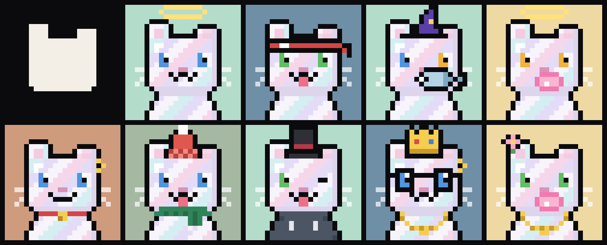
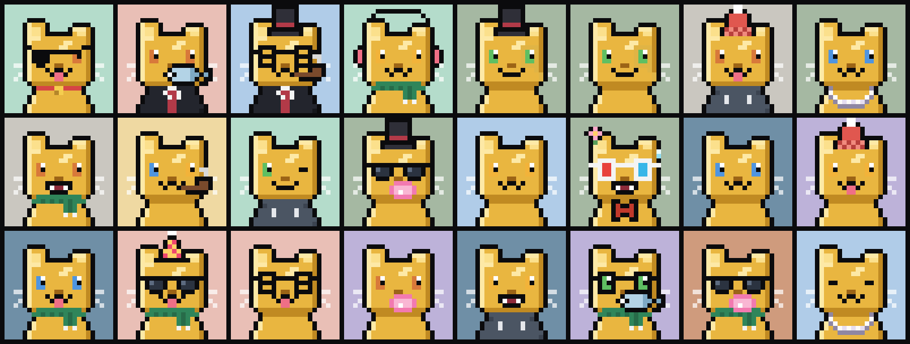

# CryptoPurrls

**10.000 con mèo pixel 24×24 mọc ra từ một logo.**


Logo Purrl là một hình khối 14×14: đầu vuông, tai trái cao 3 ô, tai phải thấp 2 ô, cằm vát hai góc. Mọi CryptoPurrl giữ nguyên silhouette đó, đặt 1:1 lên khung 24×24. Bộ lông, khuôn mặt và phụ kiện được xếp lớp lên trên theo một thứ tự cố định. Toàn bộ bộ sưu tập là hàm thuần của một seed nên ai cũng dựng lại được đúng 10.000 con và kiểm tra với provenance hash bên dưới.

```
####..........      ← tai trái cao
####......####      ← tai phải thấp; khoảng trống ở giữa là chỗ đội mũ
####......####
##############
      ×10
.############.      ← cằm vát
```

## Huyền thoại

Bốn bộ lông có số lượng cố định, các bộ lông còn lại được quay ngẫu nhiên theo trọng số.

| Bộ lông | Số lượng | Đặc điểm |
|---|---:|---|
| **Genesis** | 1 | Purrl #0 chính là logo: silhouette màu kem trên nền mực, không mặt, không phụ kiện. |
| **Pearl** | 9 | Lông xà cừ với các dải hồng, tím và xanh chạy chéo. Đây là nguồn gốc của cái tên *Purrl*. |
| **Gold** | 24 | Lông vàng đánh bóng. Không bao giờ đi cùng phụ kiện vàng để phụ kiện không bị chìm. |
| **Zombie** | 88 | Lông xanh rêu, có đường khâu trên trán và ngực. |





## Trait

Số con mang từng trait trong 10.000 Purrl:

- **Fur**: Cream 2.030 · Ginger 1.797 · Silver 1.442 · Midnight 1.215 · Tuxedo 998 · Siamese 819 · Blue 796 · Calico 781 · Zombie 88 · Gold 24 · Pearl 9 · Genesis 1
- **Background**: Purrl Blue 1.504 · Sage 1.198 · Blush 1.168 · Butter 1.165 · Mint 1.021 · Sky 1.020 · Lilac 967 · Fog 849 · Terracotta 801 · Pearl 198 · Gold Leaf 108 · Ink 1
- **Eyes**: Emerald 1.765 · Amber 1.592 · Sapphire 1.384 · Copper 1.075 · Sleepy 758 · Amethyst 464 · Odd Eyes 376 · Wink 320 · Laser 91
- **Mouth**: Purr 3.408 · Smile 2.052 · Blep 1.693 · Bubblegum 881 · Hiss 850 · Pipe 698 · Fish 417
- **Eyewear**: Shades 970 · Specs 803 · 3D Glasses 599 · Monocle 511 · Eye Patch 504 · VR Headset 414 · Gold Shades 191
- **Headwear**: Beanie 859 · Top Hat 773 · Headband 715 · Headphones 647 · Bow 585 · Flower 571 · Party Hat 544 · Halo 365 · Wizard Hat 338 · Crown 130
- **Outfit**: Collar & Bell 1.813 · Gold Chain 1.060 · Bow Tie 1.021 · Hoodie 999 · Suit 826 · Scarf 815 · Pearl Necklace 421
- **Earring**: Pearl Earring 421 · Gold Hoop 338 · Diamond Stud 91

Con nào đeo kính che mắt (Shades, Gold Shades, 3D Glasses, VR Headset) thì không có trait Eyes. Laser eyes không bao giờ đi cùng kính. Không có hai Purrl nào trùng toàn bộ trait.

Hạng độ hiếm được tính theo kiểu rarity.tools: điểm là tổng `10.000 / số con mang trait` của mọi loại trait (tính cả "None") cộng thêm số phụ kiện. Hạng 1 là con hiếm nhất (#0 Genesis).

## Provenance

| | |
|---|---|
| Seed | `0x50555252` ("PURR") |
| Provenance hash | `447a2d9be878dec59933f45b08ab8009187c0a359063c16e3ef23f54f68ad19c` |
| SHA-256 của mosaic | `4b15698e61af773ef4eef6dd2c2e386ce80c3dd20071d55d834e403c265a61c9` |

Provenance hash là `sha256` của chuỗi nối các `sha256` dạng hex của từng Purrl, theo thứ tự #0 → #9999. Mỗi `sha256` được tính trên 2.304 byte RGBA thô (24×24×4) của Purrl đó. Hash mosaic được tính trên pixel RGBA của `dist/purrls.png` (2400×2400, 100 con mỗi hàng). Vì băm trên pixel chứ không băm byte PNG, kết quả không phụ thuộc phiên bản zlib. Trang gallery có nút xác minh, bấm vào sẽ dựng lại cả 10.000 con ngay trong trình duyệt và so với hai hash này.

## Cách chạy

Chỉ cần Node 18 trở lên, không có dependency nào.

```bash
npm run build       # dist/: mosaic, purrls.json, rarity.json, provenance.json, ảnh preview
npm run build:all   # thêm dist/images/<id>.png (480×480) và dist/metadata/<id>.json (ERC-721)
npm run serve       # gallery tại http://localhost:4173
```

Metadata ERC-721 để sẵn `ipfs://<IMAGES_CID>/<id>.png`. Sau khi upload thư mục `dist/images` lên IPFS, thay `<IMAGES_CID>` bằng CID thật.

## Cấu trúc

| File | Nội dung |
|---|---|
| `src/purrl.js` | Toàn bộ generator: silhouette, bảng màu, sprite ASCII của từng trait, trọng số, PRNG (mulberry32), render và tính độ hiếm. Là ES module thuần, chạy được cả trong Node lẫn trình duyệt. |
| `scripts/build.mjs` | Dựng collection rồi ghi mọi thứ vào `dist/`. |
| `scripts/png.mjs` | Bộ mã hoá PNG tối giản dựa trên `node:zlib`. |
| `scripts/serve.mjs` | Server xem thử gallery ở máy. |
| `site/index.html` | Trang gallery: trưng bày từng lớp dựng hình, các tier huyền thoại, bộ lọc trait, mosaic và nút xác minh provenance. |
| `dist/purrls.png` | Mosaic 2400×2400 chứa đủ 10.000 Purrl ở tỉ lệ 1×. |
| `dist/purrls.json` | Trait và hạng độ hiếm của từng Purrl. |

Sửa sprite hay trọng số trong `src/purrl.js` sẽ làm thay đổi bộ sưu tập và provenance hash. Hãy chạy lại `npm run build` rồi commit cả `dist/`.
